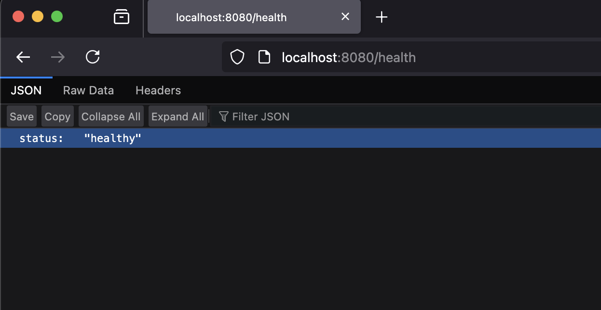
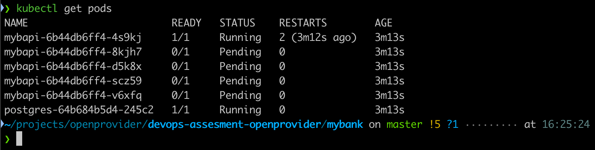
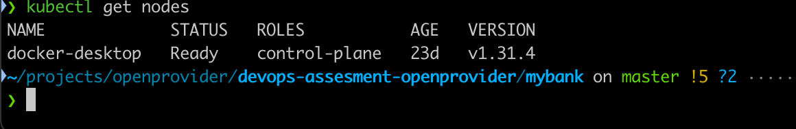

# Transaction API

Answers can be seen [here](https://github.com/emakrygiannakis/devops-assesment-openprovider?tab=readme-ov-file#assessment-tasks)

## Description

This repository contains a simple bank transaction API, developed in Go using the following technologies:

- **Gin**: Web framework
- **Viper**: Configuration management
- **sqlc**: SQL code generator
- **goose**: Database migrations

The application stores data in a PostgreSQL database and supports schema migration on startup if enabled in the configuration.

### Health Check Endpoint

A health check endpoint is available and can be used for probes:

`/health`


## Infrastructure Requirements

- **PostgreSQL Database**: Version 12

## Configuration

Configuration is managed using `spf13/viper`. Default values are specified in the `config/default.yaml` file. All configuration values can be overridden using environment variables prefixed with `BANK`.

**Example:** Override the PostgreSQL host:

```export BANK_POSTGRES_HOST=example.com:2019 ```

## How to submit results

Fork this repository and solve as many tasks from the list below as you can, following best practices of the industry.

Push your results to the personal private repository and share the final version repo and documentation with us by adding [mehrdad-op](https://github.com/mehrdad-op) and [srcCraftsman](https://github.com/srcCraftsman) as read-level access colaborators.


## Assessment Tasks

* Dockerfile: Prepare a Dockerfile to build and run this application.


The Dockerfile was created and can be found [here](Dockerfile). I have exposed the service to port 8080 and used the name mybapi (my bank api)and it has been successfully built locally. (Docker Engine: 27.5.1)
 

* Docker Compose: Create a docker-compose.yml file for local testing. The application should start and be accessible.

The docker-compose.yml was created and can be found [here](docker-compose.yml). The docker-compose was tested successfully locally by executing ```docker-compose up -d``` (Docker Compose version 2.34.0)



* GitHub Actions: Set up a workflow to build the Docker image and push it back to the repository for both the main branch and tags.

The github action can be found [Here](.github/workflows/docker-build-push.yml). 

* Helm Chart: Develop a Helm chart to deploy the application in Kubernetes. The application should:

    - Run in 5 replicas    
    In order to have 5 replicas we need to update the [value file](values.yaml#L6) and the [mybapi deployment file](mybank/templates/mybapi-deployment.yaml#L7)

    - Be deployed on nodes with the label role: api
    To deploy the api only on nodes that have the label role: api we need to set it up in [value file](values.yaml#L7:L8) and the [mybapi deployment file](mybank/templates/mybapi-deployment.yaml#L16:L17)

    - Allocate only one pod per node
    To Allocate only one pod per node we need to use [value file](values.yaml#L7:L8) and the [mybapi deployment file](mybank/templates/mybapi-deployment.yaml#L17:L27)
    
* CI for Unit Tests (Optional): Set up continuous integration for running unit tests. The command for executing tests is:
```go test -v -cover ./...```

  The unit tests fail because there isn't any database created in order for the api to connect. [Here](.github/workflows/docker-build-push.yml#L10:L27)


## Notes

I used ```imagePullPolicy:never``` in order to pull my local image so I can have a successful install on my local K8S cluster.




The reason that only one pod is running is because my local cluster has only on node


